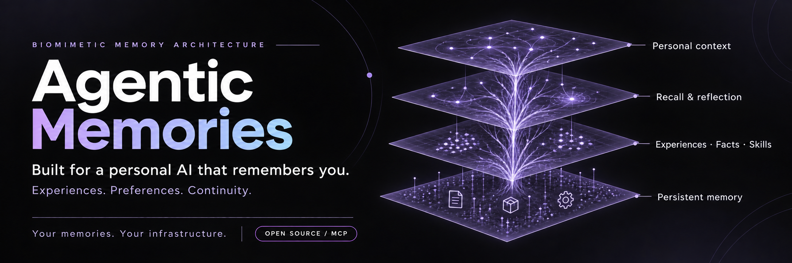
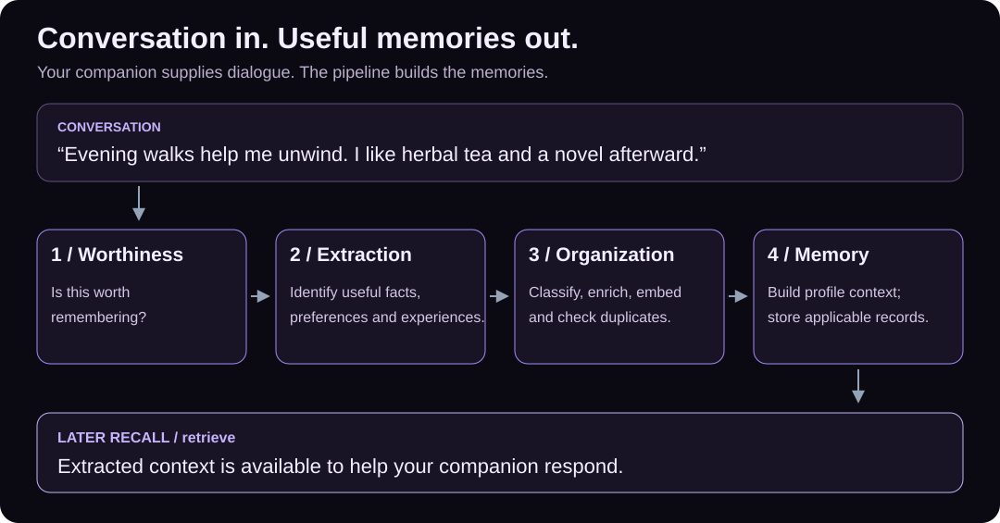
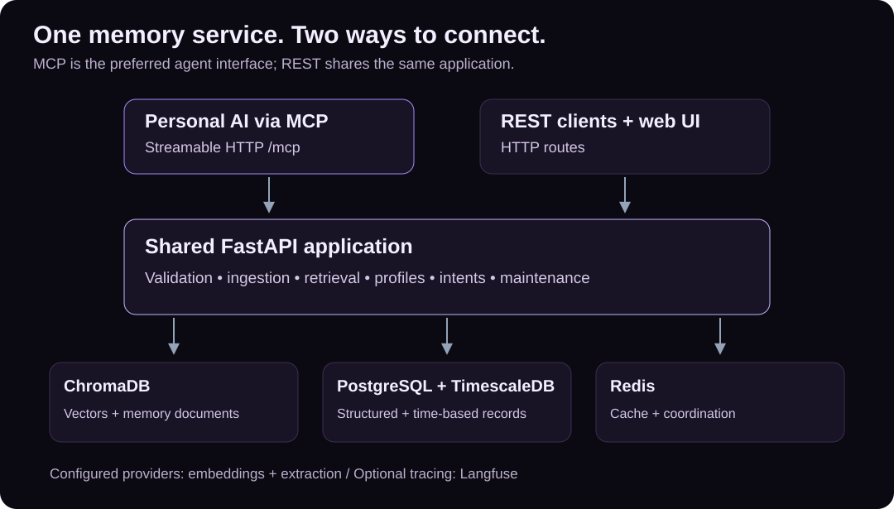

# Agentic Memories



**Turn conversations into lasting memory for your personal AI companion.**
The extraction pipeline identifies what is worth remembering, organizes experiences
and preferences, and makes that context available in later conversations. Connect
through MCP and keep stored memories on your own infrastructure.

[](https://github.com/ankitaa186/agentic-memories/actions/workflows/ci.yml)
[](LICENSE)
[](pyproject.toml)
[](docs/MCP.md)

[Get started](#get-started) · [Connect with MCP](docs/MCP.md) ·
[Documentation](docs/README.md) · [Changelog](CHANGELOG.md) ·
[Releases](https://github.com/ankitaa186/agentic-memories/releases)

## A companion that remembers what matters

Your companion should not need a manually written memory for every useful detail.
Pass it a conversation: Agentic Memories evaluates what matters, extracts memories,
classifies and enriches them, checks for duplicates, and stores the resulting context.
It can also extract structured profile information from those memories.

| What you need | What Agentic Memories provides |
| --- | --- |
| Learn from natural conversation | LLM-based worthiness assessment and memory extraction |
| Organize what matters | Classification, enrichment, duplicate checks, and profile extraction |
| Pick up a conversation later | Persistent memories and structured user profiles |
| Find relevant context | Semantic recall, time ranges, metadata filters, and structured retrieval |
| Keep information current | Updates, deletion, expiration, and consolidation |
| Connect an existing agent | MCP tools over HTTP; a REST interface is also available |

Your application decides which conversations to submit and when to retrieve context.
The pipeline handles extracting memories from the submitted conversation; connecting
an MCP client alone does not capture every interaction.

## From conversation to lasting memory



**In conversation:** “Evening walks help me unwind. I usually take a quiet route by
the water. When I get home, I like herbal tea and a novel.”

**The pipeline:** identifies useful personal information and produces classified
memories. The caller supplies conversation turns, not prewritten memory records.

**In a later session:** “How do I like to unwind in the evening?” retrieves the
extracted context for your companion's response.

The [runnable example](examples/mcp_memory.py) sends a short conversation through
`store_transcript`, prints the actual extracted memories, then recalls them through a
new MCP connection. [See the recorded run](examples/mcp-memory-output.txt); wording,
classification, and memory count can vary with the configured model.

[View the extracted-memory graphic](docs/assets/mcp-demo.svg).

## Get started

You need Docker with Compose v2, Git, Make, curl, and the PostgreSQL client (`psql`)
for migrations. An **OpenAI API key is required for embeddings**; extraction can use
OpenAI or xAI. Provider usage is billed separately. See [setup and configuration](docs/guides/getting-started.md).

```bash
git clone https://github.com/ankitaa186/agentic-memories.git
cd agentic-memories
make start
```

The first-run wizard configures your provider, starts the databases, applies migrations
when `psql` is installed, and starts the API and web UI. Check startup output for errors.

```bash
curl --fail http://localhost:8080/health/full
```

| Interface | Local address |
| --- | --- |
| **MCP — preferred for agents** | **`http://localhost:8080/mcp`** |
| REST / interactive API reference | `http://localhost:8080/docs` |
| Web UI | `http://localhost:3000` |

In your MCP client, add an **HTTP / Streamable HTTP** server with the URL above.
MCP shares the API's process and port. Client-specific configuration and authentication
options are described in the [MCP guide](docs/MCP.md).

To run the example, install [uv](https://docs.astral.sh/uv/getting-started/installation/)
and run from the repository root:

```bash
uv sync --locked
uv run python examples/mcp_memory.py
```

The example makes real extraction and embedding requests using a unique demo user.
It leaves the extracted records available for inspection. Use a dedicated demo scope.
[Example details and sample output](examples/README.md).

## Tools for useful context

| Capability | Example MCP tools | Guide |
| --- | --- | --- |
| Extract from conversation | `store_transcript`, `stream_orchestrator_message` | [Extraction pipeline](docs/guides/memory.md#conversation-extraction) |
| Recall relevant context | `retrieve`, `retrieve_structured` | [Memory lifecycle](docs/guides/memory.md) |
| Correct or remove | `patch_memory`, `delete_memory` | [Inputs and results](docs/MCP.md#results-errors-and-mutation-semantics) |
| User preferences | `get_profile`, `update_profile_field` | [API reference](docs/api-contracts-server.md) |
| Scheduled follow-ups | `create_intent`, `list_intents`, `claim_intent` | [Concepts](docs/guides/memory.md#scheduled-intents) |
| Structured portfolios | `get_portfolio`, `add_holding` | [Portfolio guide](docs/portfolio-api.md) |

Discovery currently exposes **39 application operations and 4 documentation tools**.
Use `list_tools()` for the current schemas and [the inventory](docs/mcp-route-mapping.json)
for the complete mapping. Scheduled intents store scheduling/execution state; your
integrating application supplies the worker that performs the action.

For applications that already produce structured memories, [direct writes](examples/README.md#advanced-direct-write-example)
provide an advanced path that bypasses extraction.

## Inspired by human memory

The biomimetic design draws on distinct kinds of memory: experiences (episodic),
facts (semantic), learned skills (procedural), and emotional context. Retention and
consolidation help manage what persists over time.

The broader consciousness-inspired vision is continuity: a companion can use a history
of interactions to provide personal context. These are software mechanisms and design
inspiration, not a claim that the system is conscious. See [memory concepts](docs/guides/memory.md).

## How it fits together



MCP uses the existing request pipeline for validation, service execution, and responses.
ChromaDB stores vector memories; PostgreSQL with TimescaleDB stores structured and
time-based records; Redis supports caching and coordination. The system also supports
LLM-based extraction, retrieval orchestration, and maintenance.

[Architecture](docs/guides/architecture.md) · [REST reference](docs/api-contracts-server.md) ·
[Data models](docs/data-models-server.md)

## Deployment and control

- **Self-host the service and databases.** Configure the providers and tracing your deployment uses.
- **Manage the lifecycle.** Update, delete, or expire memories; use consolidation where appropriate.
- **Protect access explicitly.** The API has no global authentication enforcement. User IDs are
  request scope, not an authorization boundary. Apply external access controls to both MCP
  and REST before remote exposure; MCP includes administrative and destructive tools.
- **Know where data goes.** Configured embedding/extraction providers receive content. Optional
  tracing can also transmit data. Self-hosting the databases does not imply offline operation.

[Deployment and upgrades](docs/guides/operations.md) ·
[MCP access controls](docs/MCP.md#access-controls-and-hosting) · [Security policy](SECURITY.md)

## Project status

Conversation extraction, MCP, memory CRUD, retrieval, profiles, scheduled-intent APIs, and portfolio APIs are
implemented. The [MCP verification report](docs/MCP-verification.md) describes regression
and live-backend checks, including their limits. Test results are evidence for those
scenarios, not a throughput benchmark or enterprise certification.

See [what changed](CHANGELOG.md), [release preparation](docs/releases/README.md), and
the [roadmap](docs/ROADMAP.md). Historical design documents describe some capabilities
that are not shipped; start with the [documentation index](docs/README.md) for current guides.

## Contribute

Bug reports, integration examples, retrieval evaluations, documentation, and security
improvements are welcome. Start with [CONTRIBUTING.md](CONTRIBUTING.md).

```bash
make install
make test-fast
python3 scripts/check_docs.py
```

[Report a bug](https://github.com/ankitaa186/agentic-memories/issues) ·
[Code of conduct](CODE_OF_CONDUCT.md) · [Apache 2.0 license](LICENSE)
