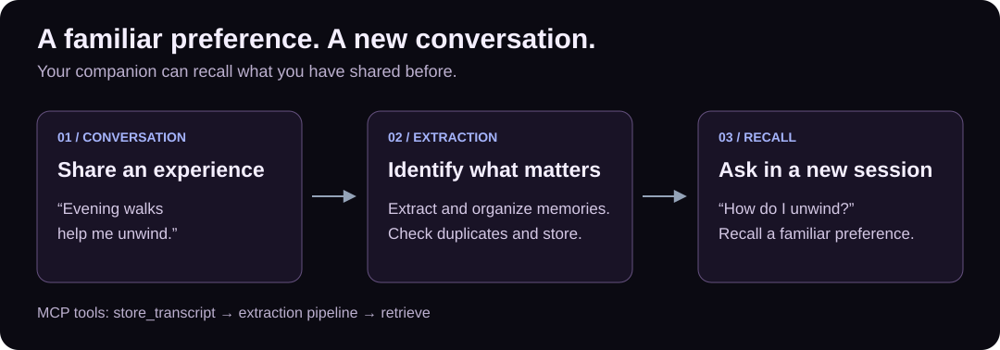

# Memory that carries across sessions

[Documentation](../README.md) / Concepts

An agent uses its current context window to answer a request. Agentic Memories adds
persistent storage and explicit tools to reuse selected information in later requests.
The integrating application decides when to call those tools and what retrieved context
to include in the model's prompt.

## Biomimetic design

Human memory offers useful design inspiration: episodic records describe experiences;
semantic records retain facts; procedural records capture skills; emotional records
retain emotional context. The software implements distinct record types, retrieval paths,
and lifecycle operations, rather than a biological model of a brain.

The consciousness-inspired ambition is personal continuity across interactions. A companion
can use remembered preferences and experiences to contextualize its next response. The
service does not establish that the companion has consciousness or subjective experience.

## Store

Use `store_memory_direct` when the application already knows the information to retain:
a project decision, a user preference, or a correction. Use `store_transcript` when you
want the extraction pipeline to select memories from a conversation. Orchestrator tools
provide another ingestion path for conversational applications.

The [cross-session example](../../examples/README.md) uses a direct write so that its
result does not depend on an extraction model deciding whether the text is worth storing.

## Recall

Use `retrieve` with a query for semantic relevance. Ordinary text recall ranks by measured
cosine similarity. Time, layer/type, and metadata filters narrow the selection; filter-only
retrieval uses its own ordering rules. Structured, persona, and narrative tools offer
additional retrieval paths. See [REST contracts](../api-contracts-server.md) and MCP discovery
for accepted fields and defaults.

Retrieved content is evidence for the agent's next answer, not proof that every stored
statement is true. Keep the distinction between remembered user statements and verified facts.

## Update and retain

- `patch_memory` changes a stored record; content changes regenerate its embedding.
- `delete_memory` removes a record across the applicable stores.
- An explicit `ttl_seconds` on direct writes applies to every memory layer. If omitted,
  short-term records use the configured default; other layers have no expiration.
- PATCH with `ttl_seconds: null` clears expiration; leaving the field out preserves it.
- TTL deletion is asynchronous. A record can linger until the next sweep; expiration is
  not a hard real-time deletion guarantee.
- Maintenance supports cleanup, deduplication, and LLM-based consolidation. Configure
  scheduling deliberately and inspect its results.

## Profiles and structured records

User profiles store named fields and completeness information. Portfolio tools support
equities and options; see the [portfolio guide](../portfolio-api.md). These structured
records complement conversational memory and have their own APIs and validation.

## Scheduled intents

Intents retain a requested action, its schedule or trigger conditions, and execution state.
An integrating worker discovers eligible intents, claims them, performs the action, and
reports the outcome. Creating an intent alone does not send an email or run an external task.

## User scope and access

Requests carry user IDs and some mutations verify record ownership. These checks do not
provide a complete identity or tenant-authorization system. Review [access controls](../MCP.md#access-controls-and-hosting)
before allowing remote users or agents to access your deployment.
